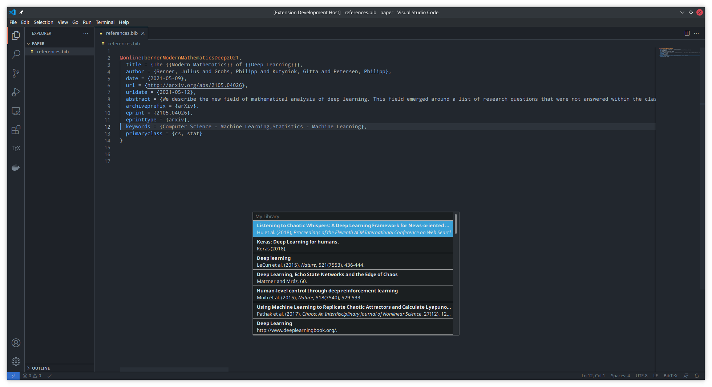

# Citations and references importer

This extension adds support for importing bibliographic references and citations directly from reference managers (currently, only [Zotero](https://www.zotero.org/) is supported).

## Features

- Import of references and citations using Zotero Picker, provided by the [Better BibTeX](https://retorque.re/zotero-better-bibtex/) extension.
- (Planned) Adding support for other reference managers.

## How to use

- Ctrl+Shift+P (Command Pallete): search for ReferenCite.
- Ctrl+Shift+A Ctrl+Shift+Z (keyboard shortcut): will open the Zotero Picker provided by the Better BibTeX extension.

You can set the default import content type by setting the `importingContentType` configuration option. For example, if you choose the `bibtex` content type, the reference is appended to a BibTeX file set in the `bibtexFile` option. The other citation content types are included directly in the current document selection.

## Dependencies

This extension acts as a proxy for other reference managers. Unfortunately, we currently only support [Zotero](https://www.zotero.org/). Therefore, you need to ensure Zotero is running and the [Better BibTeX](https://retorque.re/zotero-better-bibtex/) extension installed.